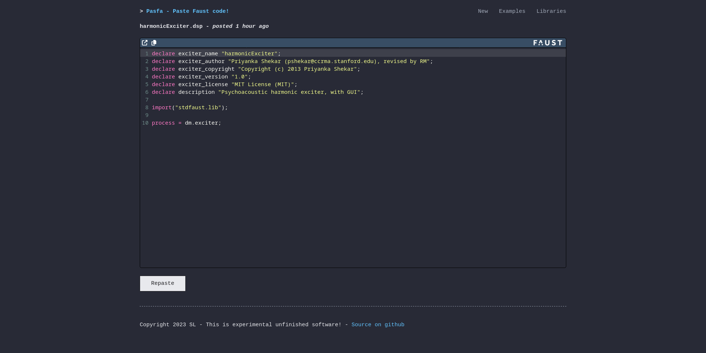
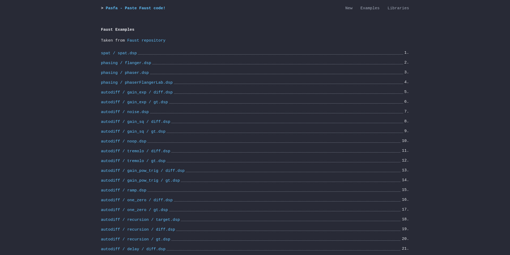
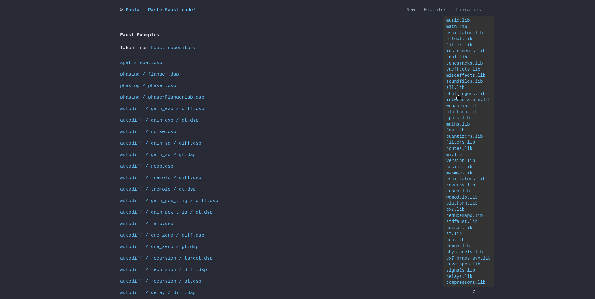

# pasfa - Paste Faust code!

> :warning: Not quite ready yet :)

Recommended to use with docker. Here's how to:
```sh
docker build -t pasfa .
docker run --name my_pasfa -p 8080:8080 -it pasfa:latest
```

Or try it here: _Working on it, available asap! :)_

#### Configuration

Config is done in `config.lua`, `docker cp` it, modify it and run a new container using eg. `-v path/to/new/config.lua:/root/work/config.lua`

Of interest are 3 fields:
- `secret` : Secret for signing CSRF
- `expiry` : Duration until pasted files expire. A table with `{ "count", "unit" }`, unit can be hour, day, minute, sec, add plural s when appropriate.
- `interval` : Interval for checking expired pastes. Same format as `expiry`.


<br>
<br>

<br>
<br>


Licensed under the terms of the MIT license.